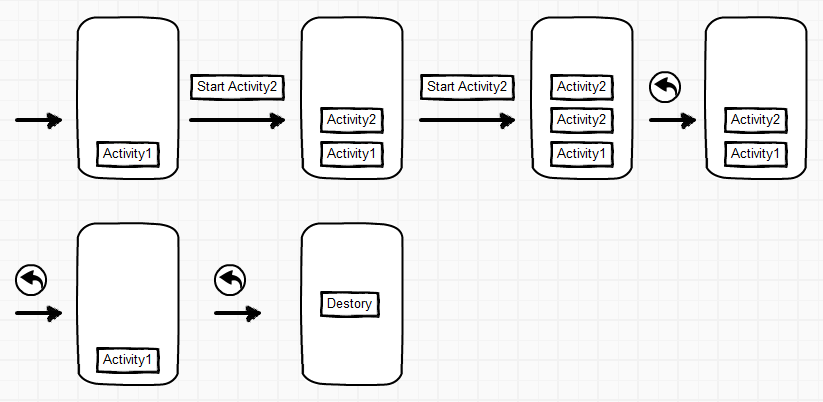
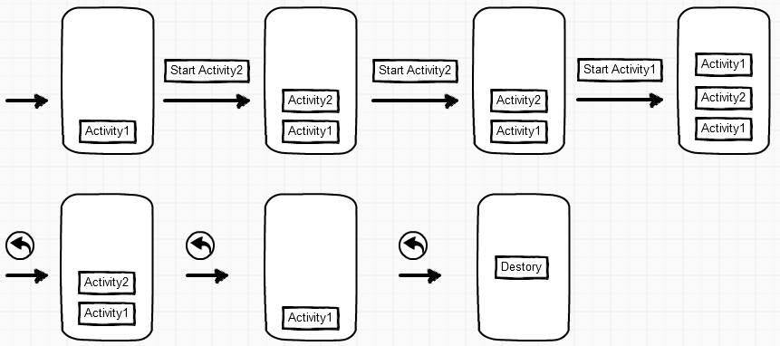
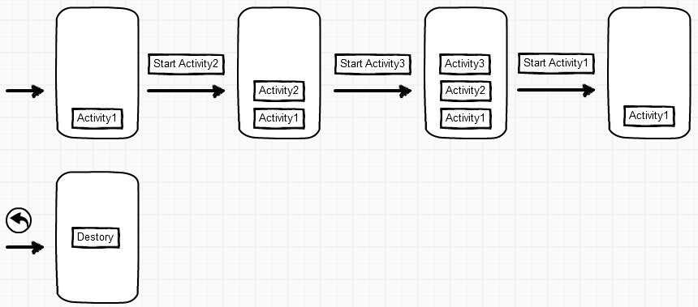
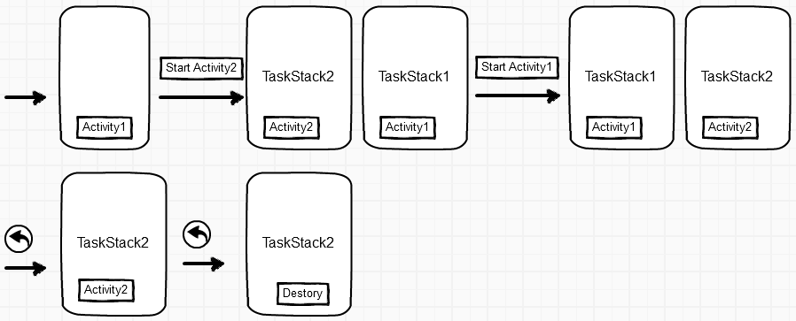

# Activity

在Android应用开发中，理解其核心组件及其相互作用是至关重要的。这些组件为开发者提供了构建功能丰富、易于使用的应用程序所需的基础设施。其中最重要的组件之一就是Activity。下面，我们将详细探讨Activity组件。

## 概念

Activity是一个关键组件，用于表示用户可以与之交互的独立界面。它通常负责处理一项特定任务或功能，并将用户的操作结果传递给其他Activity或后台服务。一个应用程序可能包含多个Activity，它们通过Intent进行通信和导航。每个Activity都有自己的生命周期，从创建到销毁，包含了一系列的状态变化。开发者需要了解并妥善管理这些状态，以确保应用程序的稳定性和用户体验。

## 使用方式

1. 创建Activity类：首先，创建一个继承自Android框架中的Activity基类（如：AppCompatActivity）的类。这个类将实现该Activity所需的功能和逻辑。

```java
public class MainActivity extends AppCompatActivity {
    //...
}
```

2. 定义布局文件：为Activity创建一个布局文件（通常是XML格式），以定义用户界面。这个文件应包含各种UI控件（如：按钮、文本框等）及其属性。

```xml
<LinearLayout xmlns:android="http://schemas.android.com/apk/res/android"
    android:layout_width="match_parent"
    android:layout_height="match_parent"
    android:orientation="vertical">

    <TextView
        android:layout_width="wrap_content"
        android:layout_height="wrap_content"
        android:text="Hello, World!" />

    <!-- 更多的UI控件 -->

</LinearLayout>
```

3. 关联布局文件：在Activity类的onCreate方法中，通过setContentView方法将布局文件与Activity关联起来。

```java
@Override
protected void onCreate(Bundle savedInstanceState) {
        super.onCreate(savedInstanceState);
        setContentView(R.layout.activity_main);

        // 初始化UI控件和事件处理
        }
```
4. 在AndroidManifest.xml中注册Activity：在应用程序的清单文件中，添加一个`<activity>`标签，以声明并注册这个Activity。

```xml
<manifest xmlns:android="http://schemas.android.com/apk/res/android"
    package="com.example.myapplication">

    <application
    ...>
    <activity android:name=".MainActivity">
        <intent-filter>
            <action android:name="android.intent.action.MAIN" />
            <category android:name="android.intent.category.LAUNCHER" />
        </intent-filter>
    </activity>

    <!-- 其他Activity及组件注册 -->
</application>
    </manifest>
```
5. 运行和调试：通过编译和运行应用程序，可以在Android设备或模拟器上查看和交互这个Activity。在开发过程中，要根据需求调整UI和逻辑，并修复可能出现的问题。

## 生命周期

Activity的生命周期是指Activity从创建到销毁的整个过程，其中包含了七个状态：`created`、`started`、`resumed`、`paused`、`stopped`、`destroyed`和`restarted`。

以下是Activity的生命周期图示：


下表描述了Activity生命周期中的各个方法及其作用：

| 方法名      | 描述                                                                                         |
| ----------- | -------------------------------------------------------------------------------------------- |
| onCreate()  | 当Activity被创建时调用。用于执行基本初始化操作，如设置布局、初始化UI控件等。                 |
| onStart()   | 当Activity从不可见变为可见时调用。此时，Activity已准备好与用户交互，但尚未完全处于活动状态。 |
| onResume()  | 当Activity完全处于活动状态，准备好与用户交互时调用。可以执行诸如开始动画、监听传感器等操作。 |
| onPause()   | 当系统准备暂停当前Activity时调用。在此方法中，应释放与Activity生命周期关联的资源。           |
| onStop()    | 当Activity完全不可见时调用。应释放不再需要的资源，以避免浪费系统资源。                       |
| onDestroy() | 当Activity即将被销毁时调用。应释放所有占用的资源，并执行清理操作。                           |
| onRestart() | 当Activity从停止状态恢复到活动状态时调用。可以重新初始化在`onStop()`方法中释放的资源。       |

需要注意的是，Activity的生命周期不一定是线性的，有时会出现跳跃或循环的情况，这取决于应用程序的行为以及用户的交互。

## 启动模式

Activity的启动模式是指Activity启动时的一些行为。Android中有四种启动模式：`standard`、`singleTop`、`singleTask`和`singleInstance`。启动模式是在Manifest文件中设置的，可以通过`android:launchMode`属性来指定。

以下是Activity的四种启动模式的图示：

### standard模式

这是默认的启动模式。每当启动一个Activity，系统都会创建一个新的实例，即使已经存在相同类型的实例。新创建的Activity实例将压入任务栈的栈顶。在这种模式下，同一个Activity可能在任务栈中有多个实例。



适用场景：适用于大多数常规场景，比如展示新闻列表的Activity，每次打开都需要创建新的实例来展示不同的新闻内容。

示例：用户浏览新闻列表，点击不同的新闻条目时，会打开不同的新闻详情页面。每个新闻详情页面都是一个新的Activity实例。

### singleTop模式

如果待启动的Activity已经位于任务栈的栈顶，系统将不会创建新的实例，而是复用栈顶的实例。如果待启动的Activity不在栈顶，系统将按照标准模式创建一个新的实例。这种模式适用于不希望重复创建同一个Activity的场景。



适用场景：适用于需要避免重复创建相同Activity的场景，例如弹出提示信息的Activity。

示例：用户点击提交按钮后，弹出一个提示信息的Activity。当用户再次点击提交按钮时，如果已经有一个提示信息的Activity在栈顶，系统将复用该实例而不是创建新的实例。

### singleTask模式

在这种模式下，系统首先检查任务栈中是否存在目标Activity的实例。如果存在，系统会将该实例上方的所有其他Activity实例移出任务栈，使目标Activity成为栈顶实例。如果不存在，系统会创建一个新的实例并压入任务栈。这种模式确保在一个任务栈中只存在一个目标Activity的实例。



适用场景：适用于需要作为应用程序入口或中心界面的Activity，例如主界面或导航界面。

示例：用户从主界面进入个人信息页面，然后进入编辑个人信息页面。在编辑页面点击保存后，应用需要直接返回主界面。这时，将主界面设置为singleTask模式，保存后直接回到栈内已有的主界面实例。

### singleInstance模式

这种模式下的Activity将独立运行在一个新的任务栈中，且任务栈中只有这个Activity。当再次启动该Activity时，系统会切换到包含该Activity的任务栈，而不是创建新的实例。这种模式适用于需要与应用程序其他部分完全隔离的Activity。



适用场景：适用于需要完全独立运行且与其他Activity无关的场景，例如悬浮窗口或某些特定功能的独立模块。

示例：假设应用中有一个悬浮音乐播放器，用户可以在使用其他功能时保持播放器界面。将音乐播放器Activity设置为singleInstance模式，确保播放器在独立任务栈中运行，不受其他Activity的影响。

# 总结
熟悉并掌握Activity的概念、生命周期和启动模式，对于构建高性能和易用的Android应用至关重要。这些基本知识将帮助我们在实际开发过程中实现更灵活的导航和有效的资源管理。