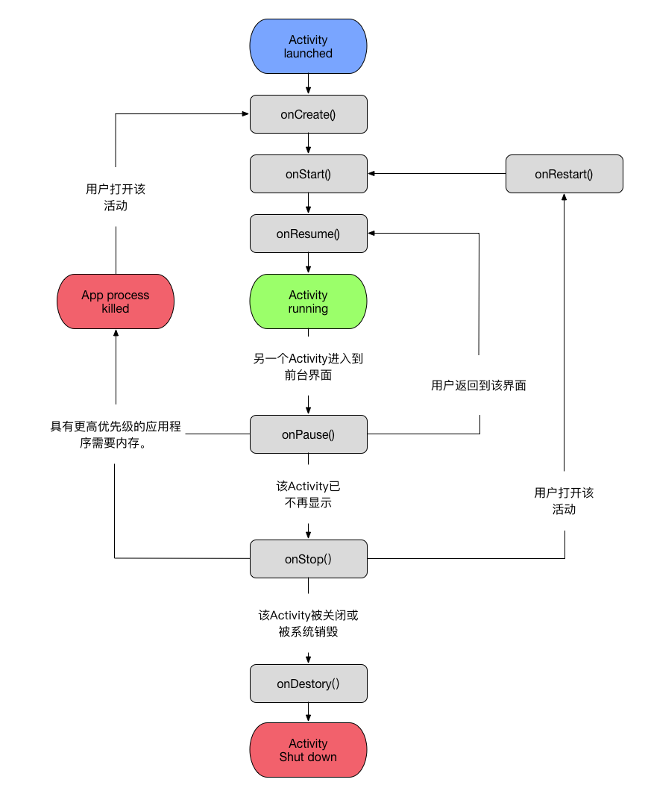

# Activity

## 一、概念

Activity 是 Android 系统的核心组件（系统的核心组件是由系统进行管理和维护的），用于处理 UI 相关的业务。

## 二、使用方式

### 2.1 注册

要声明 Activity，请打开清单文件，并添加 activity 元素作为 application 元素的子元素。例如：

```java
    <manifest ... >
      <application ... >
          <activity android:name=".ExampleActivity" />
          ...
      </application ... >
      ...
    </manifest >
```

### 2.2 过滤器

> 此功能用于隐式请求启动 Activity

```java
// 在此示例中，action 元素指定该 Activity 会发送数据。
// 将 category 元素声明为 DEFAULT 可使 Activity 能够接收启动请求。
// data 元素指定此 Activity 可以发送的数据类型
    <activity android:name=".ExampleActivity" android:icon="@drawable/app_icon">
        <intent-filter>
            <action android:name="android.intent.action.SEND" />
            <category android:name="android.intent.category.DEFAULT" />
            <data android:mimeType="text/plain" />
        </intent-filter>
    </activity>
```

### 2.3 权限

可以使用清单的 activity 标记来控制哪些应用可以启动某个 Activity。父 Activity 和子 Activity 必须在其清单中具有相同的权限，前者才能启动后者。如果您为父 Activity 声明了 uses-permission 元素，则每个子 Activity 都必须具有匹配的 uses-permission 元素。

```java
// 假设您的应用想要使用一个名为 SocialApp 的应用在社交媒体上分享文章，则 SocialApp 本身必须定义调用它的应用所需具备的权限
    <manifest>
    <activity android:name="...."
       android:permission=”com.google.socialapp.permission.SHARE_POST”
    />
```

## 三、生命周期

| 方法名      | 时机                             |
| ----------- | -------------------------------- |
| onCreate()  | 创建时调用                       |
| onStrat()   | 开始时调用                       |
| onResume()  | 交互时调用，执行完会显示出界面ui |
| onPause()   | 当前页面暂停时调用               |
| onStop()    | 当前页面停止时调用               |
| onDistory() | 页面销毁时调用                   |



## 四、启动模式

## 五、附录

