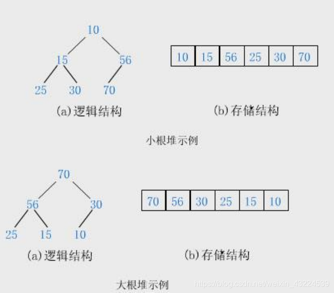
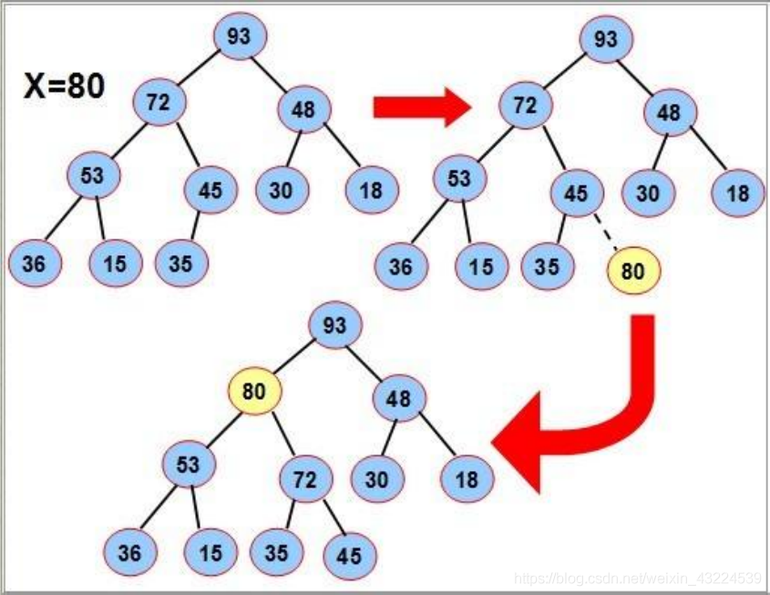
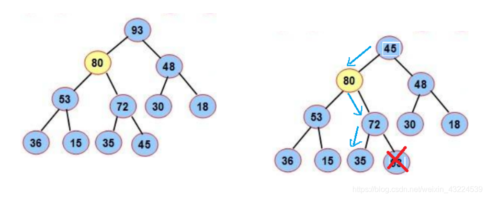
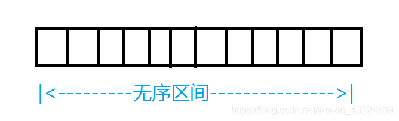
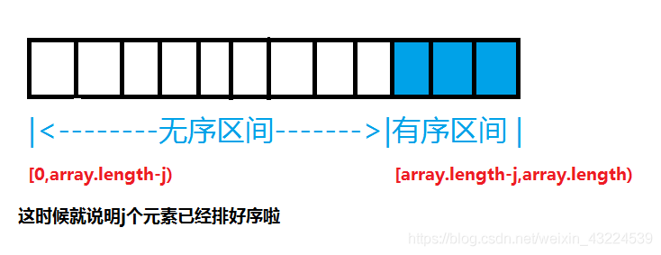

# 08-堆

## 定义：

堆就是将一个集合的数据按照完全二叉树的顺序结构存储在一个一维数组中，堆在逻辑上是一棵完全二叉树，在物理结构上是一个一维数组。

## 基本特点：

* 对于任意一个结点,都要求根的值 **大于或等于** 其所有子树结点的值
* 堆是一棵完全二叉树

## 分类：

按照根结点的大小分为**大堆**（根结点的值最大）和**小堆**（根结点的值最小）



## 基本操作：

### 堆的插入：

先插入一个80到数组的尾上，再进行向上调整算法，直到满足堆。



### 堆的删除：

删除堆是删除堆顶的数据，将堆顶的数据根最后一个数据一换，然后删除数组最后一个数据，再进行向下调整算法。



### 堆排序：

#### 堆排序的过程：

将数组分为有序区间和无序区间,刚开始有序区间元素为0，无序区间元素为array.length



每一次选择一个最大的元素放到无序区间的后面，无序区间慢慢变小，有序区间慢慢变大，直到全部元素都排好序



> 注意：堆排序只能选择最大的放到最后面，不能选择最小的放到最前面

#### 堆排序代码展示：

```java
private static void biggestHeapify(int[] array, int size, int index) {
        int max = 2 * index + 1;
        while (max < size) {
            if (max + 1 < size && array[max+1] > array[max]) {
                max += 1;
            }

            if (array[index] >= array[max]) {
                break;
            }

            int t = array[max];
            array[max] = array[index];
            array[index] = t;

            index = max;
            max = 2 * index + 1;
        }
    }

    // O(n * log(n))
    private static void heapSort(int[] array) {
        // 建大堆
        for (int i = (array.length - 2) / 2; i >= 0; i--) {
            biggestHeapify(array, array.length, i);
        }

        for (int j = 0; j < array.length; j++) {
            // 无序区间 [0, array.length - j)
            // 有序区间 [array.length - j, array.length)
            // 交换最大的数到无序部分的最后位置
            int t = array[0];
            array[0] = array[array.length - j - 1];
            array[array.length - j - 1] = t;

            // 无序部分，除了 [0] ，都满足堆的性质
            biggestHeapify(array, array.length - j - 1,0);
        }
    }
```

