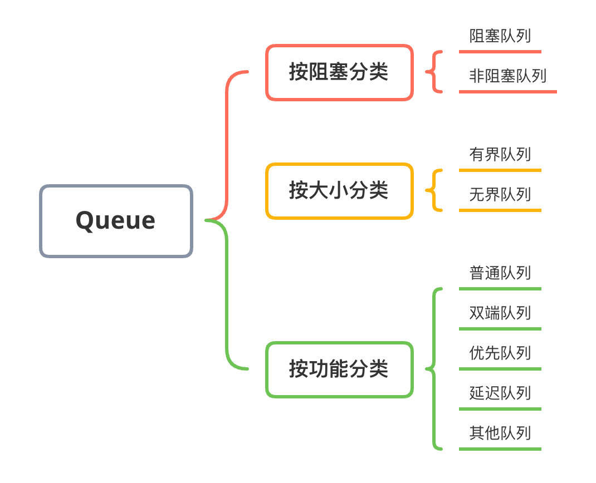
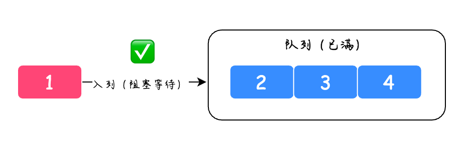
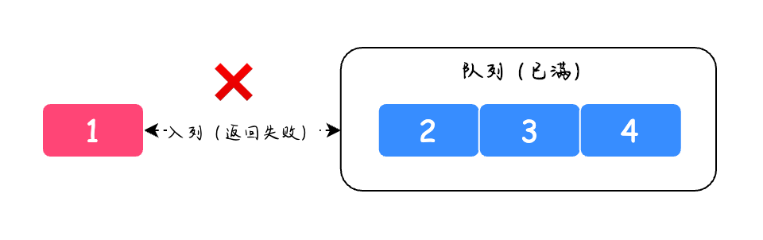
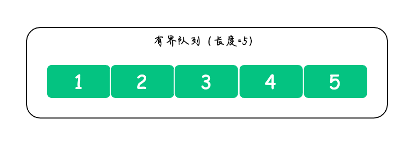
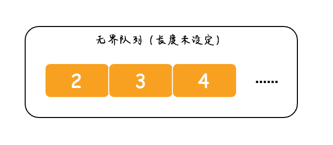

# 05-队列

## 定义

和栈一样，**队列**也是一种操作受限的线性结构。使用队列时，在一端插入元素，而在另一端删除元素。

## 基本特点

1. 队列中的数据元素遵守 "先进先出"（First In First Out）的原则，简称 FIFO 结构。
2. 限定只能在队列一端插入，而在另一端进行删除操作。

## 各项分类

## 按阻塞分类

### 阻塞队列

阻塞队列（Blocking Queue）提供了可阻塞的 `put` 和 `take` 方法，它们与可定时的 `offer` 和 `poll` 是等价的。如果队列满了 `put` 方法会被阻塞等到有空间可用再将元素插入；如果队列是空的，那么 `take` 方法也会阻塞，直到有元素可用。当队列永远不会被充满时，`put` 方法和 `take` 方法就永远不会阻塞。

我们可以从队列的名称中知道此队列是否为阻塞队列，阻塞队列中包含 `BlockingQueue` 关键字，比如以下这些：

* ArrayBlockingQueue
* LinkedBlockingQueue
* PriorityBlockingQueue
* .......

### 非阻塞队列

非阻塞队列也就是普通队列，它的名字中不会包含 `BlockingQueue` 关键字，并且它不会包含 `put` 和 `take` 方法，当队列满之后如果还有新元素入列会直接返回错误，并不会阻塞的等待着添加元素。

## 按大小分类

### 有界队列

是指有固定大小的队列，比如设定了固定大小的 `ArrayBlockingQueue`，又或者大小为 0 的 `SynchronousQueue`。

### 无界队列

指的是没有设置固定大小的队列，但其实如果没有设置固定大小也是有默认值的，只不过默认值是 Integer.MAX\_VALUE，当然实际的使用中不会有这么大的容量（超过 Integer.MAX\_VALUE），所以从使用者的角度来看相当于 “无界”的。

## 按功能分类

### 普通队列

普通队列（Queue）是指实现了先进先出的基本队列

其中 `ArrayBlockingQueue` 是用数组实现的普通队列，如下图所示：

而 `LinkedBlockingQueue` 是使用链表实现的普通队列，如下图所示：

### 双端队列

双端队列（Deque）是指队列的头部和尾部都可以同时入队和出队的数据结构

### 优先队列

优先队列（PriorityQueue）是一种特殊的队列，它并不是先进先出的，而是优先级高的元素先出队。

### 延迟队列

延迟队列（DelayQueue）是基于优先队列 `PriorityQueue` 实现的，它可以看作是一种以时间为度量单位的优先的队列，当入队的元素到达指定的延迟时间之后方可出队。

### 其他队列

在 Java 的队列中有一个比较特殊的队列 `SynchronousQueue`，它的特别之处在于它内部没有容器，每次进行 `put()` 数据后（添加数据），必须等待另一个线程拿走数据后才可以再次添加数据。

