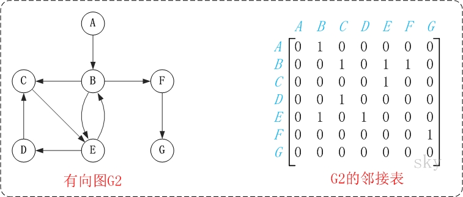
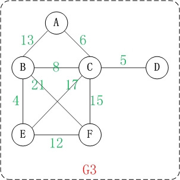

# 09-图

[TOC]

### 定义：

图是由顶点的有穷非空集合和顶点之间边的集合组成，通过表示为G=(V, E) ，其中，G标示一个图，V是图G中顶点的集合，E是图G中边的集合。

<br>

### 基本概念：

**邻接点**：一条边上的两个顶点叫做邻接点。

**度**：在无向图中，某个顶点的度是邻接到该顶点的边(或弧)的数目。在有向图中，度还有"入度"和"出度"之分。某个顶点的入度，是指以该顶点为终点的边的数目。而顶点的出度，则是指以该顶点为起点的边的数目。顶点的度=入度+出度。

**路径和回路**：

1. 路径：如果顶点(Vm)到顶点(Vn)之间存在一个顶点序列。则表示Vm到Vn是一条路径。
2. 路径长度：路径中"边的数量"。
3. 简单路径：若一条路径上顶点不重复出现，则是简单路径。
4. 回路：若路径的第一个顶点和最后一个顶点相同，则是回路。
5. 简单回路：第一个顶点和最后一个顶点相同，其它各顶点都不重复的回路则是简单回路。

**连通图和连通分量**：

1. 连通图：对无向图而言，任意两个顶点之间都存在一条无向路径，则称该无向图为连通图。 对有向图而言，若图中任意两个顶点之间都存在一条有向路径，则称该有向图为强连通图。
2. 连通分量：非连通图中的各个连通子图称为该图的连通分量。

<br>

### 存储结构：

图可以使用两种存储结构，分别是邻接矩阵和邻接表。

<br>

#### 邻接矩阵：

邻接矩阵以矩阵的形式存储图所有顶点间的关系。

##### 基本特点：

1. 邻接矩阵是正矩阵，即横纵维数相等。
2. 矩阵的每一行或一列代表一个顶点，行与列的交点对应这两个顶点的边。
3. 矩阵的点代表边的属性，1代表有边，0代表无边，所以矩阵的对角线都是0，因为对角线上对应的横纵轴代表相同的顶点，边没有意义。
4. 如果是无向图，那么矩阵是对称矩阵；如果是有向图则不一定。
5. 如果是有权图，矩阵点数值可以是权值。
6. 邻接矩阵表示图的关系非常清晰，但消耗空间较大。

##### 邻接矩阵-无向图：


##### 邻接矩阵-有向图：



<br>

#### 邻接表：

邻接表是以一组链表来表示顶点间关系

##### 基本特点：

1. 邻接表示一个有但链表组成的数组
2. 图中的每一个顶点都有一个链，数组的大小等于图中顶点的个数。
3. 无向图的链的第一个元素是本顶点，后继分别连接着和这个顶点相连的顶点；有向图的链第一个顶点是本顶点，后继是以本顶点为起点的边的终点。
4. 如果是有权图，可以在节点元素中设置权值属性
5. 邻接链表关系表示不如邻接矩阵清晰，数据结构相对复杂，但节省空间。

##### 邻接表-无向图：


##### 邻接表-有向图：


<br>

### 分类：

**无向图：** 若图 G 中的每条边都是没有方向的，则称 G 为无向图 (Undigraph) 。


**有向图：** 若图 G 中的每条边都是有方向的，则称 G 为有向图 (Digraph) 。


**带权的图：**边有实数的图。



<br>

### 图的遍历：

#### BFS(广度优先搜索)

BFS(广度优先搜索)动图如下：

.gif)

java实现如下：

```java
//模板
void bfs(){
    将起始点放入队列中
    标记起点访问
    while(如果队列不为空){
        访问队首元素
        删除队首元素
        for(x所有相邻的点){
            if(该点未被访问过且合法){
                将该点加入队列末尾
            }
        }
    }
     队列为空，广搜结束
}
//代码：（以上图为例）
import java.util.LinkedList;
import java.util.Queue;

public class BFSTest {

    /**
     * 队列
     */
    private static Queue<Vertex> queue;
    /**
     * 邻接矩阵，0表示无边，1表示有边
     */
    private int[][] edges;
    /**
     * 顶点
     */
    private Vertex[] vertices;

    /**
     * 顶点个数
     */
    private int size;
    /**
     * 初始化
     */
    public BFSTest(Vertex[] vertices,int[][] edges){
        queue=new LinkedList<>();
        this.size=vertices.length;
        this.vertices=vertices;
        this.edges=edges;
    }

    public BFSTest(){}

    /**
     * BFS方法
     */
    public void BFS(){
        //向队列加入第一个顶点
        queue.offer(vertices[0]);
        //标记第一个顶点已经被访问
        vertices[0].wasVisited=true;
        //当队列不空
        while (!queue.isEmpty()){
            //从队列中弹出并返回顶点
            Vertex item=queue.poll();
            System.out.println(item);
            
            int index=0;
            //获取顶点所在的vertices数组的下标
            if(item != null) {//这样设计避免了for循环
                 index = item.index;
            }
            //将与item相连的(即在item所在的行且邻接矩阵中值非0的)且未被访问的顶点加入到队列中
            for(int i=0;i<size;i++){
                if((edges[index][i] != 0) && (vertices[i].wasVisited == false)){
                    queue.offer(vertices[i]);
                    vertices[i].wasVisited=true;
                }
            }
        }
    }

    public static void main(String[] args){
        Vertex[] V={
                new Vertex('0',0),
                new Vertex('1',1),
                new Vertex('2',2),
                new Vertex('3',3),
                new Vertex('4',4),
                new Vertex('5',5),
                new Vertex('6',6),
                new Vertex('7',7),
                new Vertex('8',8)
        };
        int[][] edges={
                {0,1,1,0,0,0,0,0,0},
                {0,0,0,1,1,0,0,0,0},
                {0,0,0,0,1,1,1,0,0},
                {0,0,0,0,1,0,0,0,0},
                {0,1,0,0,0,0,0,1,0},
                {0,0,0,0,0,0,1,0,0},
                {0,0,1,0,0,0,0,0,1},
                {0,0,0,0,0,1,0,0,0},
                {0,0,0,0,0,0,0,0,0},
        };
        BFSTest b=new BFSTest(V,edges);
        b.BFS();
    }
    /**
     * 顶点类
     * */
   static class Vertex{
        /**
         * 顶点值
         */
        private char vertex;
        /**
         * 第index个顶点（从0开始）,这么设计避免了for循环
         */
        private int index;
        /**
         * 顶点是否被访问
         */
        private boolean wasVisited;
        public Vertex(char vertex,int index){
            this.vertex = vertex;
            this.index=index;
            wasVisited = false;
        }

        @Override
        public String toString() {
            return "Vertex{" +
                    "vertex=" + vertex +
                    '}';
        }
    }
}
```

BFS-结果如下：


<br>

#### DFS(深度优先搜索)

DFS(深度优先搜索)动图如下：

.gif)

java实现如下：（做了优化，运行过程和动图一样）

```java
//模板
void dfs(){
    输出起始顶点;
    起始顶点改为“已访问”标志;
    stack.push(起始顶点);
    while(stack非空){
          //取栈顶元素（不出栈）
          item=stack.peek();
          if(栈顶元素存在未被访问过的邻接点w){
                    输出邻接点w；
                    邻接点w改为“已访问”标志;
                    邻接点w进栈； 
          }else{
                   //当前顶点退栈
                    stack.pop();
          }
    }
    栈为空，结束；
}
//代码
import java.util.Stack;
public class DFSTest {

    /**
     * 栈
     */
    private static Stack<Vertex> stack;
    /**
     * 邻接矩阵，0表示无边，1表示有边
     */
    private int[][] edges;
    /**
     * 顶点
     */
    private Vertex[] vertices;

    /**
     * 顶点个数
     */
    private int size;
    /**
     * 初始化
     */
    public DFSTest(Vertex[] vertices, int[][] edges){
        stack=new Stack<>();
        this.size=vertices.length;
        this.vertices=vertices;
        this.edges=edges;
    }

    public DFSTest(){}

    /**
     * DFS方法
     */
    public void DFS(){
        //输出第一个顶点
        System.out.println(vertices[0]);
        //将第一个顶点压栈
        stack.push(vertices[0]);
        //标记已经被访问过
        vertices[0].wasVisited=true;
        //栈顶顶点
        Vertex item;
        //栈顶顶点所在的行
        int row;
        //需要回溯到某一行的某一列(避免每次都从第1列扫描每行，作为优化)
        int column=0;
        //当栈不空
        while (!stack.isEmpty()){
            item=stack.peek();
            row=item.index;
            column=isExistAdjacentPoint(row,column);
            //判断栈顶元素是否存在未被访问过的邻接点
            if(column == -1){//不存在
                stack.pop();
                //回溯到上一行的下一列，例如当前在2号顶点，2号顶点是从（6,2）过来的，
      // 2号顶点已经遍历完了，发现没有满足条件的邻接点，那么下次就会遍历 （6,3）,
                // 避免了从（6,0）开始遍历，这段代码利用了邻接矩阵中行与列的关系
                column=row+1;
            }else {//存在
                System.out.println(vertices[column]);
                vertices[column].wasVisited=true;
                stack.push(vertices[column]);
                //下一次从第一列开始遍历，例如（1,3）满足条件，
                // 那么下次会从（3,0）开始遍历寻找与3相邻的邻接点
                column=0;
            }

        }
    }

    /**
     * 判断是否存在邻接点
     * @param row 当前顶点所在的行号
     * @param column  当前顶点所在的行的所有列
     * @return 下标，若不存在，则返回-1
     */
    private int isExistAdjacentPoint(int row, int column) {
        for(int i=column;i<size;i++){
            if((edges[row][i] !=0) && (vertices[i].wasVisited==false)){
                return i;
            }
        }
        return -1;
    }

    public static void main(String[] args){
        Vertex[] V={
                new Vertex('0',0),
                new Vertex('1',1),
                new Vertex('2',2),
                new Vertex('3',3),
                new Vertex('4',4),
                new Vertex('5',5),
                new Vertex('6',6),
                new Vertex('7',7),
                new Vertex('8',8)
        };
        int[][] edges={
                {0,1,1,0,0,0,0,0,0},
                {0,0,0,1,1,0,0,0,0},
                {0,0,0,0,1,1,1,0,0},
                {0,0,0,0,1,0,0,0,0},
                {0,1,0,0,0,0,0,1,0},
                {0,0,0,0,0,0,1,0,0},
                {0,0,1,0,0,0,0,0,1},
                {0,0,0,0,0,1,0,0,0},
                {0,0,0,0,0,0,0,0,0},
        };
        DFSTest b=new DFSTest(V,edges);
        b.DFS();
    }
    /**
     * 顶点类
     * */
   static class Vertex{
        /**
         * 顶点值
         */
        private char vertex;
        /**
         * 第index个顶点（从0开始）,这么设计避免了for循环
         */
        private int index;
        /**
         * 顶点是否被访问
         */
        private boolean wasVisited;
        public Vertex(char vertex,int index){
            this.vertex = vertex;
            this.index=index;
            wasVisited = false;
        }

        @Override
        public String toString() {
            return "Vertex{" +
                    "vertex=" + vertex +
                    '}';
        }
    }
}
```

DFS-结果如下：

