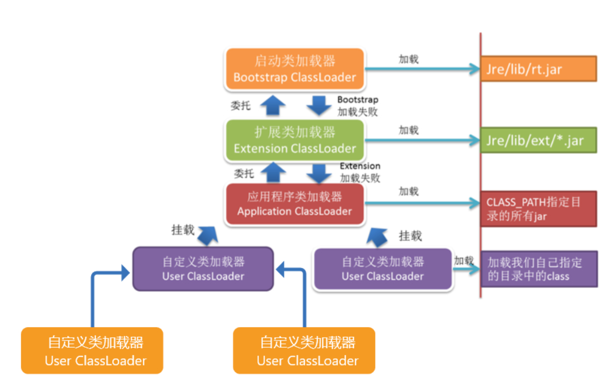

# 类加载机制

## 背景：

jvm的类加载是通过ClassLoader及其子类来完成的

## 层次：



## 原理：

### 双亲委派机制

#### 一、流程

1、检查自身是否被加载过

2、若未加载，则调用父类加载器

3、若父类加载器为空，则调用启动类加载器

4、上述增加try，若失败则捕获异常

5、异常中调用findClass方法进行加载

```java
// 具体流程可见代码
protectedsynchronized Class<?> loadClass(String paramString, boolean paramBoolean)
    throws ClassNotFoundException
  {
       //检查是否被加载过
    Class localClass =findLoadedClass(paramString);
       //如果没有加载，则调用父类加载器
    if (localClass == null) {
      try {
           //父类加载器不为空
        if (this.parent != null)
          localClass = this.parent.loadClass(paramString,false);
        else {
      //父类加载器为空，则使用启动类加载器，传统意义上启动类加载器没有父类加载器
          localClass =findBootstrapClass0(paramString);
        }
      }
      catch (ClassNotFoundExceptionlocalClassNotFoundException)
      {
           //如果父类加载失败，则使用自己的findClass方法进行加载
        localClass = findClass(paramString);
      }
    }
    if (paramBoolean) {
      resolveClass(localClass);
    }
    return localClass;
  }
```

#### 二、特点

1、全盘负责 --> 当一个类加载器负责加载某个Class时，该Class所依赖的和引用的其他Class也将由该类加载器负责载入，除非显示使用另外一个类加载器来载入

2、父类委托 --> 先让父类加载器试图加载该类，只有在父类加载器无法加载该类时才尝试从自己的类路径中加载该类

3、缓存机制 --> 缓存机制将会保证所有加载过的Class都会被缓存，当程序中需要使用某个Class时，类加载器先从缓存区寻找该Class，只有缓存区不存在，系统才会读取该类对应的二进制数据，并将其转换成Class对象，存入缓存区。

#### 三、其他

打破双亲委派的两种方式：

1、通过spi机制，使用ServiceLoader.load去加载

2、通过自定义类加载器，继承classloader，重写loadClass方法
