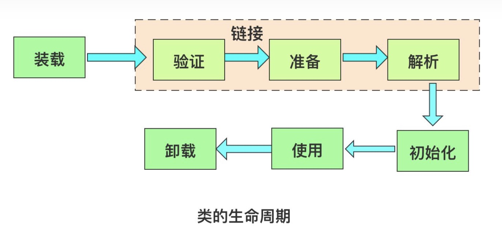

# java类生命周期

## 背景：

类的完整生命周期包括：加载、验证、准备、解析、初始化、使用、卸载

## 流程：

### 一、装载

将class加载到JVM中

1、加载类的二进制数据

2、在JVM堆中创建java.lang.Class对象

3、在JVM方法区中存储类信息

> 此处还涉及到**类加载机制**

### 二、验证

对class信息进行验证

主要包括四种检查类型：

| 检查类型     | 检查子项                   | 备注 |
| ------------ | -------------------------- | ---- |
| 格式检查     | 魔数检查                   |      |
|              | 版本检查                   |      |
|              | 长度检查                   |      |
| 语义检查     | 是否继承final              |      |
|              | 是否有父类                 |      |
|              | 抽象方法是否有实现         |      |
| 字节码验证   | 跳转指令是否指向正确位置   |      |
|              | 操作数类型是否合理         |      |
| 符号引用验证 | 符号引用的直接引用是否存在 |      |

### 三、准备

为类变量（静态变量）分配内存并设置默认值

### 四、解析

将常量池的符号引用转换为直接引用

### 五、初始化

为类变量（静态变量）赋予正确的初始化值

### 六、使用

### 七、卸载

类的卸载
