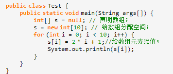
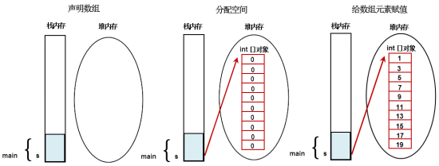

# 01-数组

[TOC]


### 数组的定义：

数组是相同类型数据的有序集合。数组描述的是相同类型的若干个数据，按照一定的先后次序排列组合而成。其中，每一个数据称作一个元素，每个元素可以通过一个索引(下标)来访问它们。

<br>

### 数组的基本特点：

1. 长度是确定的。数组一旦被创建，它的大小就是不可以改变的。

2. 数组的元素在堆内存中被分配空间，并且是连续分配的

3. 增删效率低，需要移动被修改后的所有元素

4. 查询效率高，时间复杂度O(1)

5. 空间复杂度，一维数据是O(n)，多维（MxN）数组是O(mxn)

6. 其元素必须是相同类型，不允许出现混合类型。元素的类型可以是java 支持的任意类型，包括基本类型和引用类型。

7. 使用new 关键字对数组进行内存的分配。每个元素都会被JVM赋予默认值。

   > 默认规则：
   >
   > - 整数：0 
   > - 浮点数：0.0 
   > - 字符：\u0000 
   > - 布尔：false 
   > - 引用数据类型：null。

8. 数组的元素都是有序号的，序号从0开始，0序的。称作数组的下标、索引、角标

<br>

### 数组的声明：

1. 声明的时候并没有实例化任何对象，只有在实例化数组对象时，JVM才分配空间，这时才与长度有关。
2. 声明一个数组的时候并没有数组真正被创建。
3. 构造一个数组，必须指定长度。

<br>

### 数组格式：

```java
dataType[] arrayRefVar = new dataType[arraySize];
```

dataType：基础类型、引用类型

[ ] ：代表这是数组类型

arrayRefVar：一个合法的标识符，命名规范和局部变量规范一致

new：是java 的关键字。用来向JVM申请内存的

dataType[arraySize] ：决定了向JVM申请的内存空间的大小。 （大小：元素类型字节数 * 元素个数）

arraySize：只要是一个合法的java 表达式就可以。 返回一个int 类型的值即可






<br>

### 数组常见问题：

```java
int[] arr = new int[3];
System.out.print(arr[3])
//ArrayIndexOutOfBoundException,角标越界

arr = null;
System.out.print(arr[0])
//NullPointException,空指针异常
```

<br>

### 数组优缺点：

##### 优点：

1. 可以保存若干个数据。
2. 随机访问的效率很高。根据下标访问元素效率高（元素连续分配空间）。

##### 缺点：

1. 数组的元素的类型必须一致。元素类型必须一致。
2. 连续分配空间在堆中，如果数组的元素很多，对内存的要求更加的严格。
3. 根据内容查找元素效率比较低，需要逐个比较个。
4. 删除元素、插入元素效率比较低，需要移动大量的元素。
5. 数组定长，不能自动扩容。
6. 数组没有封装，数组对象只提供了一个数组长度的属性，但是没有提供方法用来操作元素。

<br>

### 数组的初始化：

静态初始化：

```java
int[] arr = { 1, 2, 3 };// 静态初始化基本类型数组；
```

动态初始化：

```java
int[] arr = new int[2];//动态初始化数组，先分配空间；
arr[0] = 1;//给数组元素赋值；
arr[1] = 2;//给数组元素赋值；
```

默认初始化：

```java
int arr[] = new int[2]; // 默认值：0,0
boolean[] b = new boolean[2]; // 默认值：false,false
String[] s = new String[2]; // 默认值：null, null
```

<br>

### 数组的遍历：

##### for循环

```java
public class Test {
    public static void main(String[] args) {
        int[] a = new int[4];
        //初始化数组元素的值
        for (int i = 0; i < a.length; i++) {
            a[i] = 100 * i;
        }
        //读取元素的值
        for (int i = 0; i < a.length; i++) {
            System.out.println(a[i]);
        }
    }
}
```

##### for-each循环

```java
public class Test {
    public static void main(String[] args) {
        String[] ss = {"aa", "bb", "cc", "dd"};
        for (String temp : ss) {
            System.out.println(temp);
        }
    }
}
```

<br>

### 数组的操作：

##### 数据的拷贝

```java
/**
* 数据拷贝
*
* @param src     源数组
* @param srcPos  源数组要复制的起始位置
* @param dest    目的数组
* @param destPos 目的数组放置的起始位置
* @param length  复制的长度
*/
public static native void arraycopy(Object src, int srcPos,
                                        Object dest, int destPos,
                                        int length);
```

<br>

##### 数据的打印

```java
public class Test {
    public static void main(String[] args) {
        int[] a = {1, 2};
        System.out.println(a);//数据引用地址值
        System.out.println(Arrays.toString(a));//[1,2]
    }
}
```

<br>

##### 数组元素排序

```java
public class Test {
    public static void main(String[] args) {
        int[] a = {1, 3, 9, 6, 5};
        System.out.println(Arrays.toString(a));//[1,3,9,6,5]
        Arrays.sort(a);
        System.out.println(Arrays.toString(a));//[1,3,5,6,9]
    }
}
```

> Arrays.sort 底层实现：
>
> 1. 如果数据元素个数超过286且数据具备结构，则为归并排序
> 2. 如果数据元素个数大于47则为快速排序
> 3. 最后情况则使用插入排序

<br>

##### 数组查找元素

```java
public class Test {
    public static void main(String[] args) {
        int[] a = {1, 3, 9, 6, 5};
        System.out.println(Arrays.toString(a));//[1,3,9,6,5]
        Arrays.sort(a);//底层是使用二分法，所以在查找前面需要排序
        System.out.println(Arrays.toString(a));//[1,3,5,6,9]
        System.out.println("该元素的索引是：" + Arrays.binarySearch(a, 9));//该元素的索引是：2
    }
}
```

<br>

##### 数组填充

```java
public class Test {
    public static void main(String[] args) {
        int[] a = {1, 3, 9, 6, 5};
        System.out.println(Arrays.toString(a));//[1,3,9,6,5]
        Arrays.fill(a, 2, 4, 0);//将索引2到4的元素替换为0
        System.out.println(Arrays.toString(a));//[1,3,0,0,5]
    }
}
```

<br>

### 多维数组

多维数组可以看成是数组的数组，比如二维数组就是一个特殊的一维数组，其每一个元素都是一个一维数组

##### 多维数组的动态初始化（以二维数组为例）

```java
type[][] typeName = new type[typeLength1][typeLength2];
```
