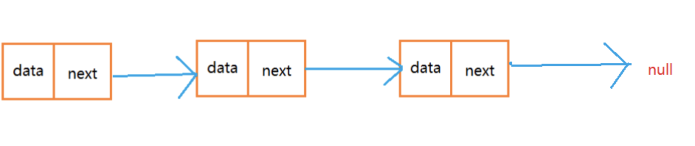
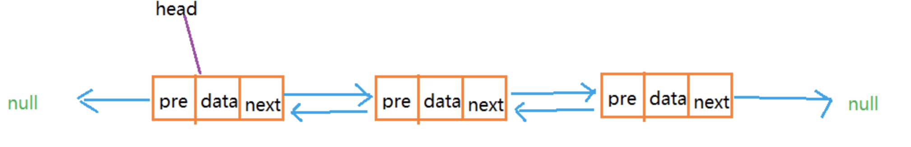
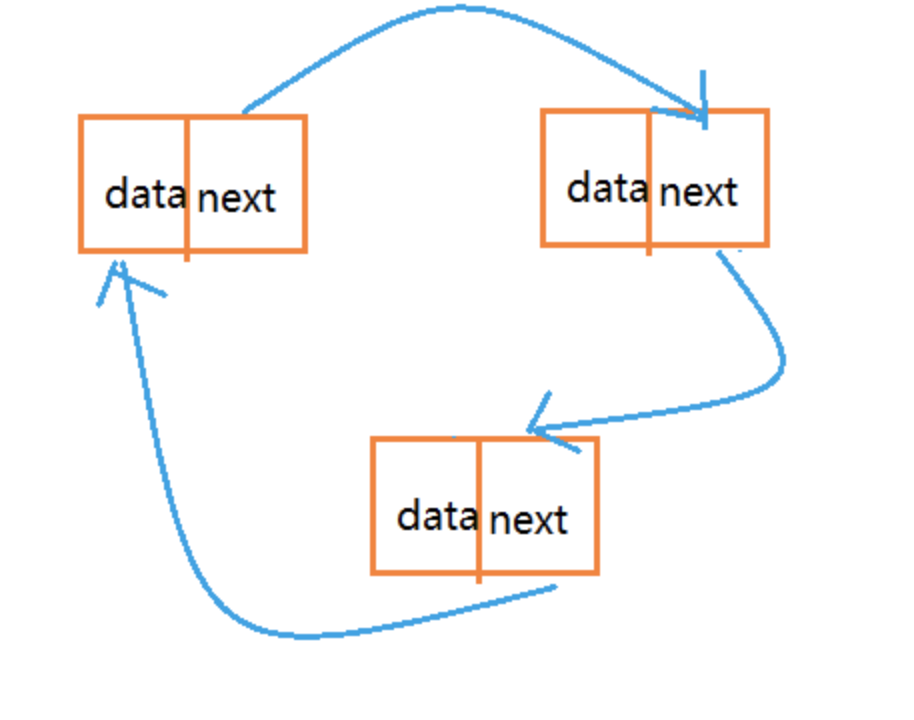
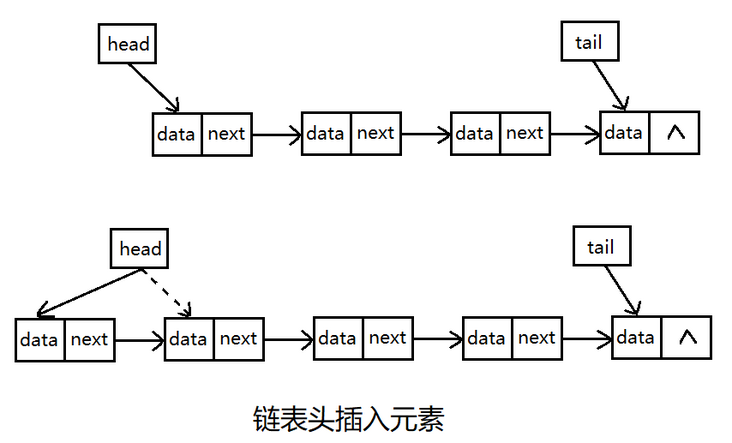
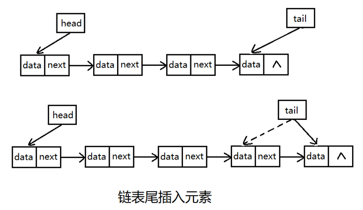
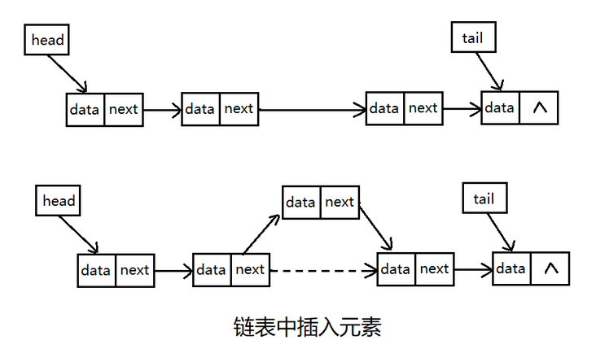
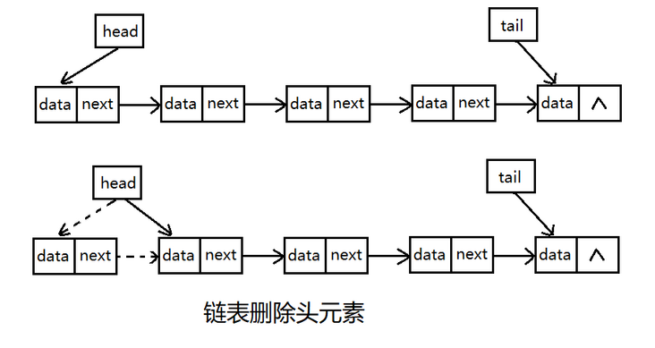
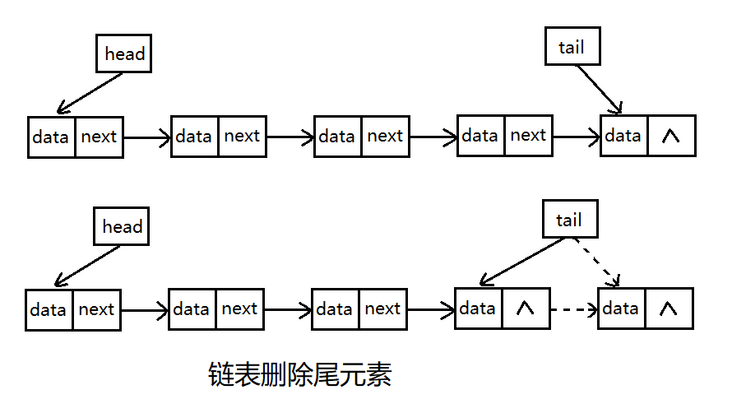
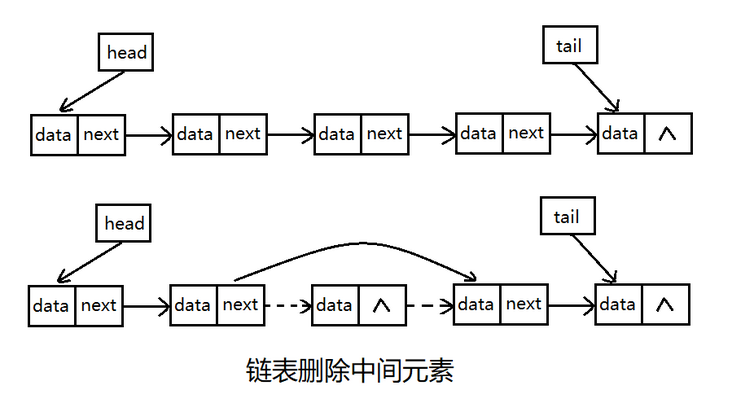

# 02-链表

### 链表的定义：

链表是由若干结点组成，每个结点至少包括两部分信息：一个是元素数据，一个是指向下一个（上一个）元素地址的指针。链表的存储在物理上是非连续、非顺序的存储结构，数据元素之间是通过每个元素的指针来关联的。

<br>

### 链表的基本特点：

1. 长度不确定，长度可动态变化
2. 结点在内存地址是非连续的内存空间
3. 增删效率高，只需要修改指针指向
4. 查询效率低，时间复杂度O(n)
5. 空间复杂度O(n)

<br>

### 链表的类型：

##### 单链表

链表是一种不需要连续内存空间的线性表。

每个内存块被称为结点。

每个结点有一个 数据域和指针域，数据域用来存储数据，而指针 域用来保存下一个结点的地址。

单链表的尾结点指向 NULL。

而单链表是最简单的链表。可以将单链表想象成如下图所示：



<br>

##### 双链表

双向链表，其实就是链表的每个结点都可以知道自己的前一个结点和后一个结点。

每个结点都有一个前驱指针和后驱指针，分别存储前一个结点和后一个结点在内存中的地址。

head 指向链表第一个有效结点。



<br>

##### 循环链表

循环链表，其实就是特殊的单链表。

单链表的尾结点指向 NULL，而循环链表的尾结点指向头结点，构成环状。



<br>

### 链表的操作

链表的操作包括了创建、删除、插入、输出。

创建就是空间的分配，将头、尾指针及链表结点个数等初始化。

删除和插入根据被操作元素的位置可以细分为头删除（插入），尾删除（插入），中间删除（插入），以下详细介绍。

<br>

#### 1. 插入操作

插入分为头插入，尾插入，中间插入。

<br>

##### 1.1 头插入

头插入实际上是增加一个新节点，然后把新增加的结点指针指向原来头指针指向的元素，再把头指针指向新增的节点。



<br>

##### 1.2 尾插入

尾插入也是增加一个新节点，该节点指针置为null，然后把原尾结点指针指向新增加的节点，最后把尾指针指向新增加的节点即可。



<br>

##### 1.3 中间插入

中间插入稍复杂，首先增加一个节点，然后新增节点的指针指向插入位置的后一个节点，把插入位置的前一个节点指针指向新插入节点即可。



<br>

#### 2. 删除操作

删除与插入类似，根据被操作元素的位置分为头删除，尾删除，中间删除。

<br>

##### 2.1 头删除

删除头元素时，先将头指针指向下一个节点，然后把原头结点的指针置空即可。



<br>

##### 2.2 尾删除

删除尾元素时，首先找到链表倒数第2个元素，然后把尾指针指向这个元素，接着把原倒数第2个元素的指针置空。



<br>

##### 2.3 中间删除

删除中间元素相对复杂一些，首先将要删除的节点的前一个节点指针指向要删除的节点的下一个节点，然后把要删除节点的指针置空。



<br>

3. 代码实现（Java）

```java
//节点部分
public class Node {
    private int data;  //数据
    private Node next;  //指针
    
    public int getData() {
        return data;
    }
    public void setData(int data) {
        this.data = data;
    }
    public Node getNext() {
        return next;
    }
    public void setNext(Node next) {
        this.next = next;
    }    
}
```

```java
//链表实现
public class Link {
    private int size = 0;
    private Node first;
    private Node last;
    
    /*链表初始化 */
    public Link(){}
    
    /**
     * 返回链表长度
     * @return 返回链表长度
     */
    public int getLength(){
        return size;
    }
    
    /**
     * 获取指定位置的节点
     * @param index 位置[0~size]
     * @return 
     */
    public Node get(int index){
        Node temp = first;
        for(int i=0;i<index;i++){
            temp = temp.getNext();
        }
        return temp;
    }
    
    /**
     * 链表中插入第一个元素时，头和尾时同一个元素
     * @param element
     */
    private void onetNode(int element){
        first = new Node();
        first.setData(element);
        last = first;
    }
    
    /**
     * 链表只剩一个节点时，清除first和last
     */
    private void clear(){
        first = null;
        last = null;
        size = 0;
    }
    
    /**
     * 插入尾节点
     * @param element
     */
    public void addTail(int element){
        if(size==0){   //链表为空时，插入尾节点即第一个节点
            onetNode(element);
        }else{
            Node node = new Node();
            node.setData(element);
            last.setNext(node);
            last = node;   //尾节点设置为插入的节点
        }
        size++;
    }
    
    /**
     * 链表头插入
     * @param element
     */
    public void addHead(int element){
        if(size==0){
            onetNode(element);
        }else{
            Node node = new Node();
            node.setData(element);
            node.setNext(first);  //新插入元素的指针指向原头元素
            first = node;  //新插入的元素设为头节点
        }
        size++;
    }
    
    /**
     * 插入中间元素，考虑头尾两种特殊情况
     * @param index 位置
     * @param element  值
     */
    public void add(int index,int element){
        if(index < size){  
            if(size==0){  //空链表
                onetNode(element);
                size++;
            }else if(index==0){ //插入的位置是头
                addHead(element);
                size++;
            }else if(size==index+1){  //插入的位置是尾
                addTail(element);
                size++;
            }else{  
                Node temp = get(index);   //获取插入位置的节点
                Node node = new Node();   //插入新节点
                node.setData(element);
                node.setNext(temp.getNext());  
                temp.setNext(node);
                size++;
            }
        }else{
                throw new IndexOutOfBoundsException("插入位置无效或超出链表长度");
        }
    }
    
    /**
     * 删除头节点
     */
    public void deleFirst(){
        if(size==0){
            throw new IndexOutOfBoundsException("空链表，无元素可删除");
        }else if(size==1){ //只剩一个节点时，清除first和last
            clear();
        }else{
            Node temp = first;  //为了将删除的头结点置空
            first = first.getNext();
            temp = null;
            size--;
        }
    }
    
    /**
     * 删除尾节点
     */
    public void deleLast(){
        if(size==0){
            throw new IndexOutOfBoundsException("空链表，无元素可删除");
        }else if(size==1){ //只剩一个节点时，清除first和last
            clear();
        }else{
            Node temp = get(size-1);  //获取最后元素的前一个节点（前驱）
            temp.setNext(null);
            size--;
        }
    }
    
    /**
     * 删除中间元素，考虑了头尾和超界
     * @param index 位置
     */
    public void deleMid(int index){
        if(size==0){
            throw new IndexOutOfBoundsException("空链表，无结点可删");
        }else if(size==1){
            clear();
        }else{
            if(index==0){
                deleFirst();
            }else if(index==size-1){
                deleLast();
            }else if(index>size){
                throw new IndexOutOfBoundsException("删除位置超界");
            }else{
                Node temp = get(index-1);
                temp.setNext(get(index));
                temp.setNext(null);
                size--;
            }
        }
    }
    
    /**
     * 获取链表
     */
    public void getAll(){
        Node temp = first;
        System.out.println(temp.getData());
        while(temp.getNext()!=null){
            System.out.print(temp.getData()+"-->");
            temp = temp.getNext();
            size--;
        }
    }    
}
```

