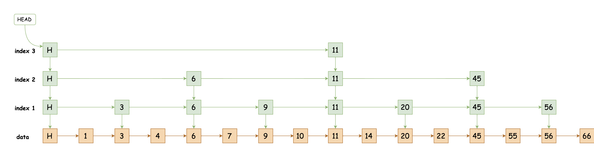
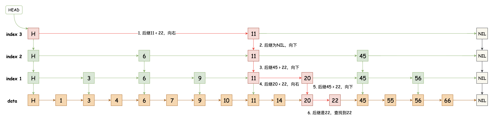
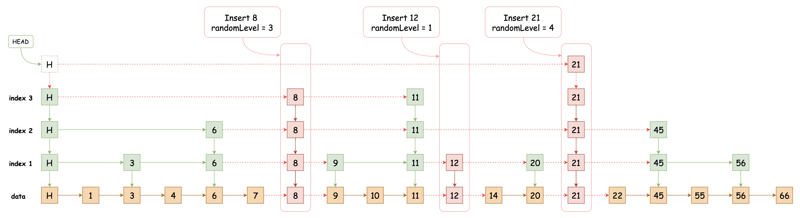
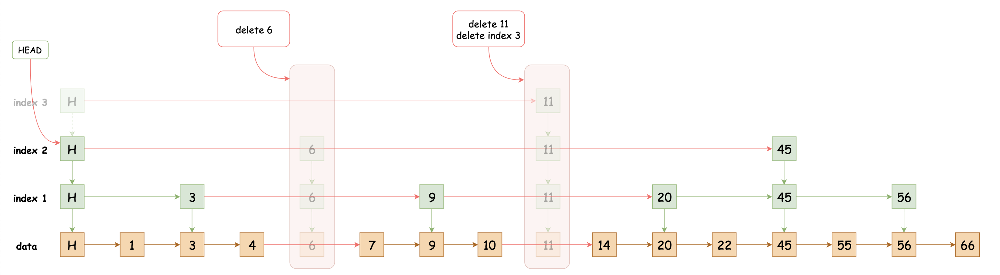

# 03-跳表

[TOC]

### 跳表的定义

跳表（SkipList）是一种随机化的数据结构，通过“空间来换取时间”的一个算法，建立多级索引，实现以二分查找遍历一个有序链表。

 

### 跳表的基本特点

1. 最底层包含所有节点的一个有序的链表
2. 每一层都是一个有序的链表
3. 每个节点都有两个指针，一个指向右侧节点（没有则为空），一个指向下层节点（没有则为空）
4. 必备一个头节点指向最高层的第一个节点，通过它可以遍历整张表
5. 查找／添加／插入／删除操作都能够在O（LogN）的复杂度内完成

 

### 跳表的结构

跳表的核心思想是通过建立索引层来缩短链表的搜索路径，以达到快速搜索的目的。
假设我们从链表中的每两个节点中提取出一个建立一级索引，然后再从每两个一级索引中提取一个建立二级索引，以此类推，就可以得到如下图所示的结构，其中绿色节点表示索引。

 

### 跳表的查询

跳表的搜索需要从高层索引开始向下逐层搜索，每一层的搜索方式和普通链表是一样的，当后继节点的关键字大于搜索关键字时结束本层的搜索，进入下一层继续搜索。下图展示了跳表搜索关键字 22 的过程，其中红色部分就是搜索的路径。

 

### 跳表的插入

通过随机函数生成一个随机的索引等级之后，创建一个新的索引列，并将每一层的新索引链接到它的前驱索引的后面，如果生成的随机等级大于当前跳表的最大索引等级，需要添加一层新的索引。如下图所示，其中红色虚线箭头表示重新建立的链接。

 

### 跳表的删除

跳表的删除操作比较简单，先查询删除的关键字，如果在索引层匹配到了关键字，就向下删除所有的索引和数据节点，如果没有匹配到索引，只需要删除数据节点即可。其中有一点需要注意的是，在删除索引后需要检测一下，如果当前层的HEAD索引的后继索引为NIL，则表示这一层已经没有索引了，需要删除这个索引层。如下图所示，红色箭头表示重新建立的链接。

