# 07-树

[TOC]

### 定义：

树（英语：tree）是一种抽象数据类型（ADT）或是实现这种抽象数据类型的数据结构，用来模拟具有树状结构性质的数据集合。它是由n（n>0）个有限节点组成一个具有层次关系的集合。把它叫做“树”是因为它看起来像一棵倒挂的树，也就是说它是根朝上，而叶朝下的。

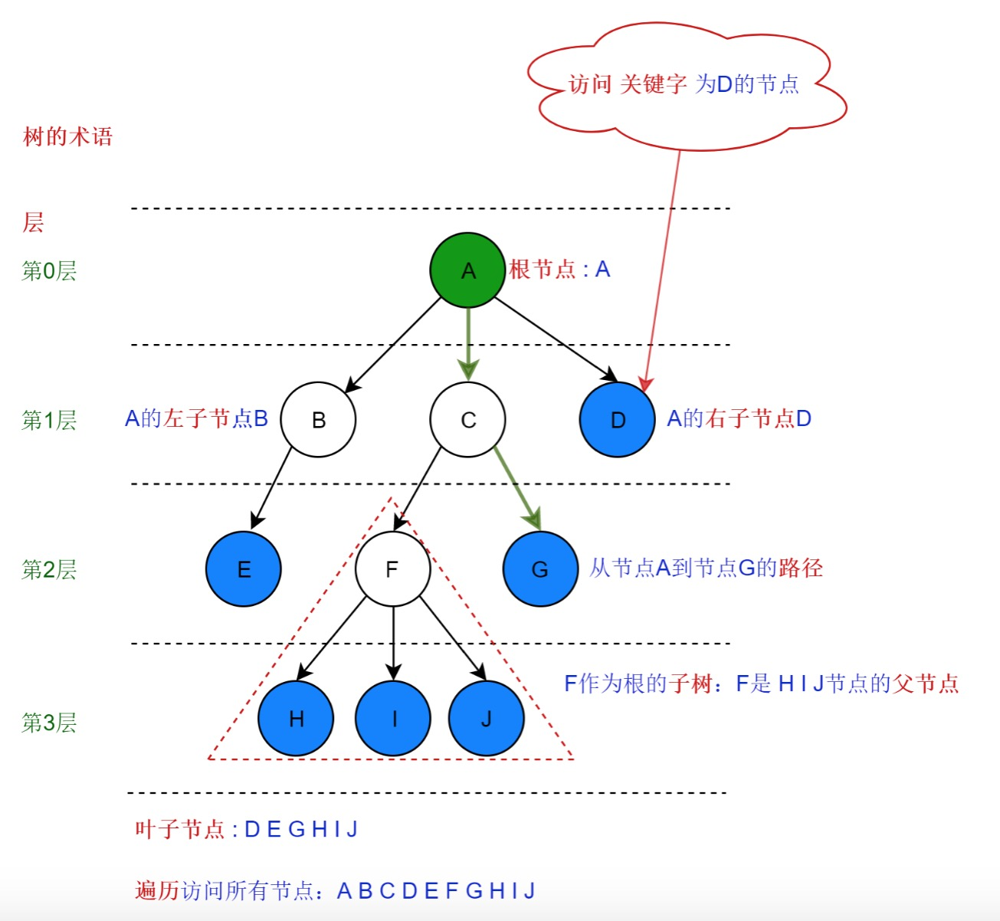

 

### 基本特点：

- 每个节点都只有有限个子节点或无子节点；
- 没有父节点的节点称为根节点；
- 每一个非根节点有且只有一个父节点；
- 除了根节点外，每个子节点可以分为多个不相交的子树；
- 树里面没有环路(cycle)

 

### 种类：

- 无序树：树中任意节点的子节点之间没有顺序关系，这种树称为无序树，也称为自由树；
- 有序树：树中任意节点的子节点之间有顺序关系，这种树称为有序树； 　
- 二叉树：每个节点最多含有两个子树的树称为二叉树； 　　
- 完全二叉树：对于一颗二叉树，假设其深度为d（d>1）。除了第d层外，其它各层的节点数目均已达最大值，且第d层所有节点从左向右连续地紧密排列，这样的二叉树被称为完全二叉树； 　　　
- 满二叉树：所有叶节点都在最底层的完全二叉树； 　　
- 平衡二叉树（AVL树）：当且仅当任何节点的两棵子树的高度差不大于1的二叉树； 　　
- 排序二叉树(二叉查找树（英语：Binary Search Tree))：也称二叉搜索树、有序二叉树； 　
- 霍夫曼树：带权路径最短的二叉树称为哈夫曼树或最优二叉树； 　　
- B树：一种对读写操作进行优化的自平衡的二叉查找树，能够保持数据有序，拥有多于两个子树。

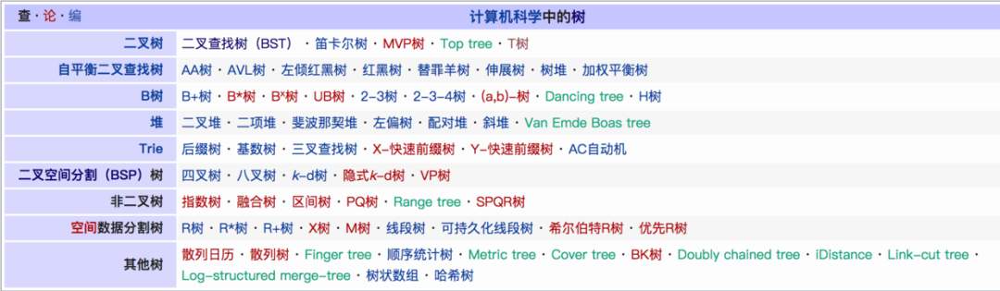

 

#### 二叉树：

二叉树（英文名：Binary Tree）是每个结点最多有两个子树的树结构，通常子树被称作“左子树”（left subtree）和“右子树”（right subtree）。

按照这个定义，在逻辑上二叉树可以进行五种基本形态的分类：

- 1、空二叉树；
- 2、只有一个根结点的二叉树；
- 3、只有左子树的二叉树；
- 4、只有右子树的二叉树；
- 5、拥有左、右子树的二叉树；

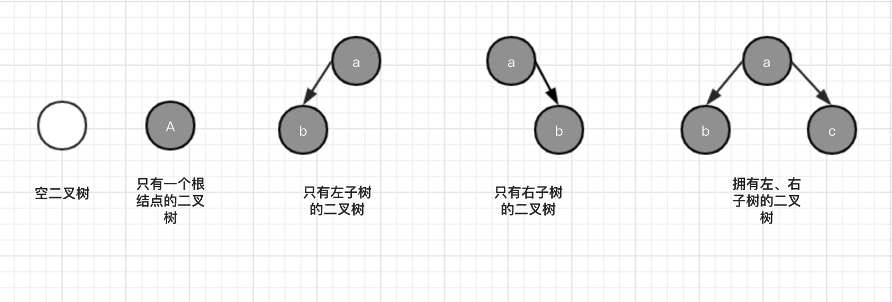

 

##### 完全二叉树：

完全二叉树是一种特殊的二叉树，特性如下：

- 所有叶子节点都出现在 k 或者 k-1 层，而且从 1 到 k-1 层必须达到最大节点数；
- 第 k 层可以不是满的，但是第 k 层的所有节点必须集中在最左边；
- 任何一个节点不能只有左子树没有右子树；
- 叶子节点出现在最后一层或者倒数第二层，不能再往上；

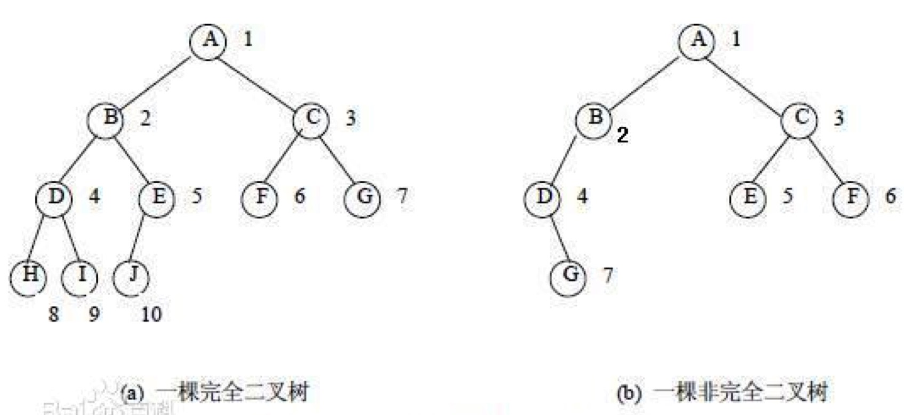

 

##### 满二叉树：

除最后一层结点均无任何子节点外，每一层的所有结点都有两个子结点的树，称为满二叉树！

也就是说，如果一个二叉树的层数为`K`，且结点总数是`(2^k) -1`

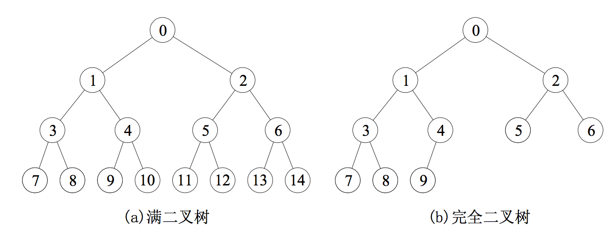

 

##### 平衡二叉树：

平衡二叉树的提出就是为了保证树不至于太倾斜，尽量保证两边平衡，特性如下：

- 平衡二叉树要么是一棵空树；
- 要么保证左右子树的高度之差不大于 1；
- 左右两个子树都是一棵平衡二叉树；

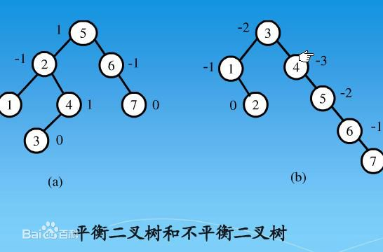

 

##### 二叉查找树：

二叉查找树，也被称为**二叉排序树**，可以说是从**算法层面**来定义二叉树结构，这种算法思路适用于所有的二叉树结构，特性如下：

- 若左子树不空，则左子树上所有结点的值均小于它的根结点的值；
- 若右子树不空，则右子树上所有结点的值均大于或等于它的根结点的值；
- 它的左、右子树也分别为二叉查找树；

 

#### 红黑树：

红黑树，英文名称：red-black tree，简称 RBT！红黑树也是基于平衡二叉树结构的一种实现，但是它的平衡指标没有像 AVL 算法那样要求很严格，并不是高度平衡但基本平衡，特性如下：

- 每一个结点要么是红色，要么是黑色；
- 根结点是黑色的；
- 所有叶子结点都是黑色的（实际上都是Null指针，下图用NIL表示）。叶子结点不包含任何关键字信息，所有查询关键字都在非终结点上；
- 每个红色结点的两个子节点必须是黑色的。换句话说：从每个叶子到根的所有路径上不能有两个连续的红色结点；
- 从任一结点到其每个叶子的所有路径都包含相同数目的黑色结点；

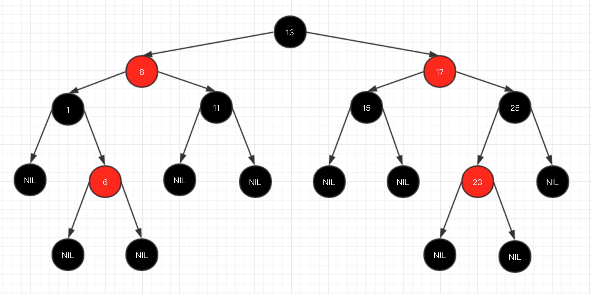

 

#### 哈夫曼树：

哈夫曼树是一种特殊结构的二叉树，主要由哈夫曼编码实现，内容定义如下：

> 给定N个权值作为N个叶子结点，构造一棵二叉树，若这棵二叉树的带权路径长度达到最小，则称这样的二叉树为最优二叉树，也称为Huffman树。

哈夫曼树是带权路径长度最短的树，权值较大的结点离根较近。

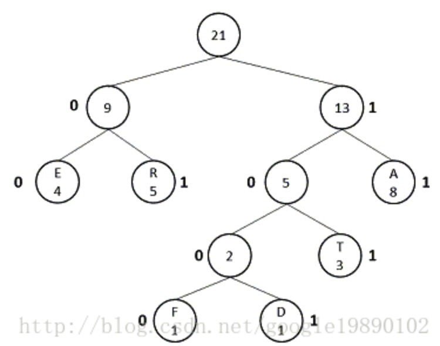

 

#### B树：

一个m阶（该树每个节点最多有 M 个子节点）的B树具有以下特征：

1. 根节点至少有两个子女。
2. 每个中间节点都包含k-1个元素和k个孩子，其中 m/2 <= k <= m
3. 每一个叶子节点都包含k-1个元素，其中 m/2 <= k <= m
4. 所有的叶子节点都位于同一层。
5. 每个节点中的元素从小到大排列，节点当中k-1个元素正好是k个子节点包含的元素的值域分划。

> 应用场景：MongoDB

一个3阶的B树插入示意图如下：

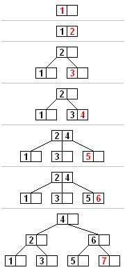

 

#### B+树：

一个m阶的B+树具有以下特征：

1. 有k个子树的中间节点包含有k个元素（B树中是k-1个元素），每个元素不保存数据，只用来索引，所有数据都保存在叶子节点。
2. 所有的叶子节点中包含了全部元素的信息，及指向含这些元素记录的指针，且叶子节点本身依关键字的大小自小而大顺序链接。
3. 所有的中间节点元素都同时存在于子节点，在子节点元素中是最大（或最小）元素。

看不懂没关系，我们只需要知道这些限制条件是为了让B+树数据“矮而胖”就好。

> 应用场景：Mysql InnoDB存储引擎。

这里我直接放张掘金小册《从根儿上理解MYSQL》B+树主键索引的示意图：

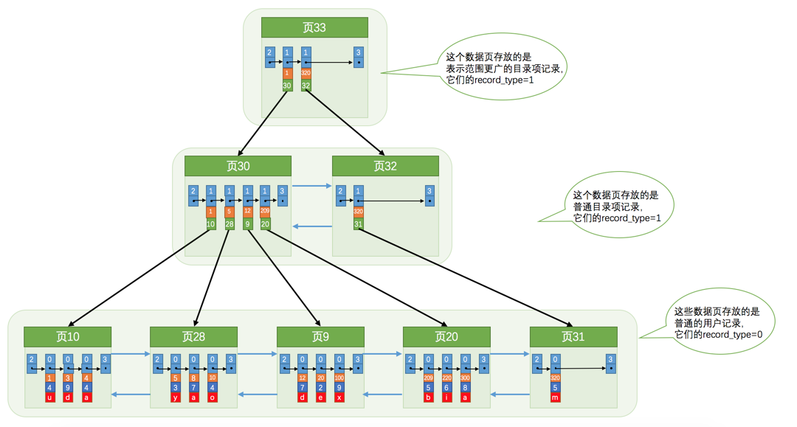

 

> **B树 vs B+树：**
>
> 看图说话，B树 和 B+树显著不同的地方是：
>
> 1. B树非叶子节点即是索引，也是数据；B+树非叶子节点仅是索引，数据全部存储在叶子节点。
> 2. B+树叶子节点的数据之间是用链表链接的。
>
> **B+树相比B树：**
>
> 1. 数据的连续性：B+树叶子节点上一页存储的数据是连续的，当需要一个节点上的数据时，B+树可以增大缓存的命中率。
> 2. 叶子节点之间的连接性：当作范围或全文扫描时，B+树可以依赖叶子节点做线性顺序扫描，而B树只能在每一层的节点上做扫描。B+树同样可以增大缓存的命中率。
>
> **B树相比B+树：**
>
> 1. 当作单一数据查询时，B树的节点平均离根节点更近，平均查询效率比B+树快。
>
> **总结一下：**
>
> B+树相比B树，前者更适合范围查询，后者更适合单一数据查询。

 

### 遍历：

所谓树的遍历（Traversal），就是按照某种次序访问树中的节点，且每个节点恰好访问一次。也就是说，按照被访问的次序，可以得到由树中所有节点排成的一个序列。

#### 前序遍历

访问顺序是：根节点→左子树→右子树，下图遍历的结果是：A→B→D→E→C→F

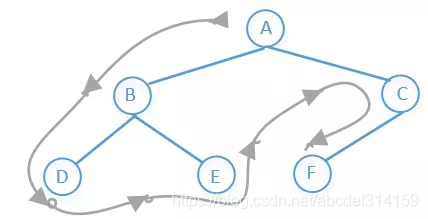

 

#### 中序遍历

访问顺序是：左子树→根节点→右子树，下图遍历的结果是：D→B→E→A→F→C

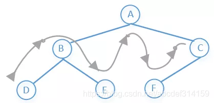

 

#### 后序遍历

访问顺序是：左子树→右子树→根节点，下图遍历的结果是：D→E→B→F→C→A

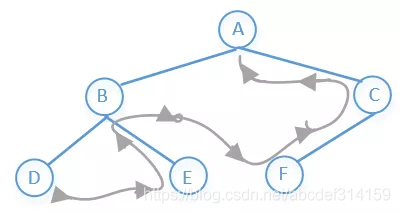

 

#### 层序遍历（BFS，宽度优先搜索，又称广度优先搜索）

访问顺序是：先访问上一层，在访问下一层，一层一层的往下访问，下图遍历的结果是：A→B→C→D→E→F

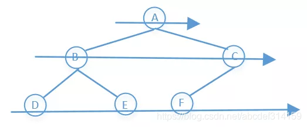