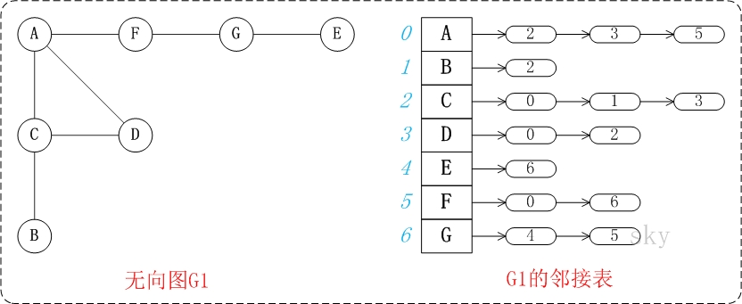
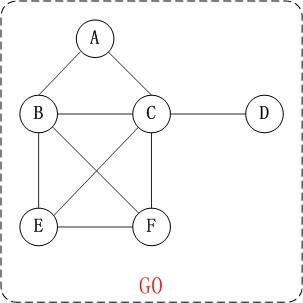

# 09-图

[TOC]

### 定义：

图是由顶点的有穷非空集合和顶点之间边的集合组成，通过表示为G=(V, E) ，其中，G标示一个图，V是图G中顶点的集合，E是图G中边的集合。

 

### 基本概念：

**邻接点**：一条边上的两个顶点叫做邻接点。

**度**：在无向图中，某个顶点的度是邻接到该顶点的边(或弧)的数目。在有向图中，度还有"入度"和"出度"之分。某个顶点的入度，是指以该顶点为终点的边的数目。而顶点的出度，则是指以该顶点为起点的边的数目。顶点的度=入度+出度。

**路径和回路**：

1. 路径：如果顶点(Vm)到顶点(Vn)之间存在一个顶点序列。则表示Vm到Vn是一条路径。
2. 路径长度：路径中"边的数量"。
3. 简单路径：若一条路径上顶点不重复出现，则是简单路径。
4. 回路：若路径的第一个顶点和最后一个顶点相同，则是回路。
5. 简单回路：第一个顶点和最后一个顶点相同，其它各顶点都不重复的回路则是简单回路。

**连通图和连通分量**：

1. 连通图：对无向图而言，任意两个顶点之间都存在一条无向路径，则称该无向图为连通图。 对有向图而言，若图中任意两个顶点之间都存在一条有向路径，则称该有向图为强连通图。
2. 连通分量：非连通图中的各个连通子图称为该图的连通分量。

 

### 存储结构：

图可以使用两种存储结构，分别是邻接矩阵和邻接表。

 

#### 邻接矩阵：

邻接矩阵以矩阵的形式存储图所有顶点间的关系。

##### 基本特点：

1. 邻接矩阵是正矩阵，即横纵维数相等。
2. 矩阵的每一行或一列代表一个顶点，行与列的交点对应这两个顶点的边。
3. 矩阵的点代表边的属性，1代表有边，0代表无边，所以矩阵的对角线都是0，因为对角线上对应的横纵轴代表相同的顶点，边没有意义。
4. 如果是无向图，那么矩阵是对称矩阵；如果是有向图则不一定。
5. 如果是有权图，矩阵点数值可以是权值。
6. 邻接矩阵表示图的关系非常清晰，但消耗空间较大。

##### 邻接矩阵-无向图：

##### 邻接矩阵-有向图：

 

#### 邻接表：

邻接表是以一组链表来表示顶点间关系

##### 基本特点：

1. 邻接表示一个有但链表组成的数组
2. 图中的每一个顶点都有一个链，数组的大小等于图中顶点的个数。
3. 无向图的链的第一个元素是本顶点，后继分别连接着和这个顶点相连的顶点；有向图的链第一个顶点是本顶点，后继是以本顶点为起点的边的终点。
4. 如果是有权图，可以在节点元素中设置权值属性
5. 邻接链表关系表示不如邻接矩阵清晰，数据结构相对复杂，但节省空间。

##### 邻接表-无向图：

##### 邻接表-有向图：

 

### 分类：

**无向图：** 若图 G 中的每条边都是没有方向的，则称 G 为无向图 (Undigraph) 。

**有向图：** 若图 G 中的每条边都是有方向的，则称 G 为有向图 (Digraph) 。

**带权的图：**边有实数的图。

 

### 图的遍历：

未完待续